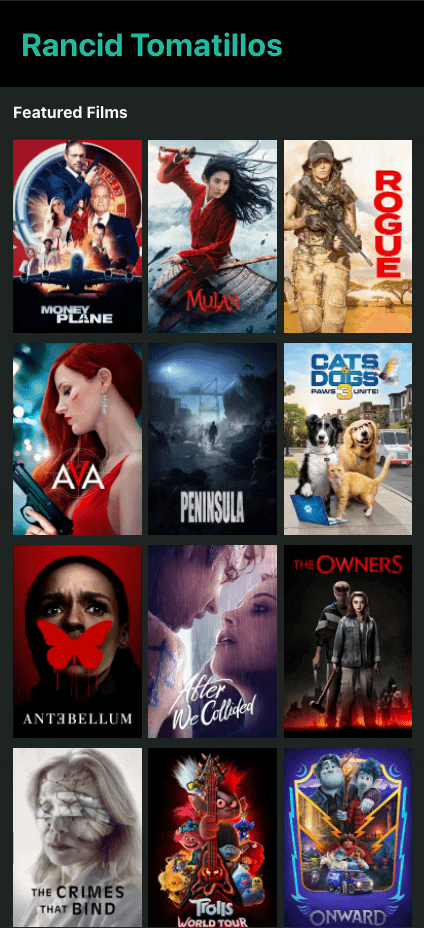

# Rancid Tomatillos

Rancid Tomatillos was a Mod 3 paired project in the Front End program at the [Turing School of Software and Design](https://turing.io/). The assignment was to build out a multi-page application using [React](https://reactjs.org/) and [Router](https://reactrouter.com/). We used [Cypress](https://www.cypress.io/) and [PropTypes](https://reactjs.org/docs/typechecking-with-proptypes.html) to test user stories and our data model.

The project spec can be found [here](https://frontend.turing.edu/projects/module-3/rancid-tomatillos-v3.html).

Our project is deployed on [Heroku](https://tomatillos-2021.herokuapp.com/) and [GitHub Pages](https://alexmkio.github.io/rancid-tomatillos/#/).

## Install

1. Clone down this repository `git clone https://github.com/alexmkio/rancid-tomatillos`
2. CD into your local clone `cd rancid-tomatillos`
3. Install project dependencies `npm install`
4. Run `npm start`
5. Open `http://localhost:3000/` in your preferred browser

## Features

* Gif of the app home and movie details pages

* Gif of fetch error handling

* Gif showing responsiveness of the app from the most popular desktop resolution (1920x1080) to mobile layout in 428x926 (iPhone 12 Pro Max)

## Contributors

This application was built by [Lauren Kessell](https://github.com/LKessell) and [Alex Kio](https://github.com/alexmkio/); Front End Engineering, Mod 3 students at the [Turing School of Software and Design](https://turing.io/).

## Technologies Used

This application was built using the [React](https://reactjs.org/) javascript framework. [Router](https://reactrouter.com/) was used for multi-page functionality. [Cypress](https://www.cypress.io/) and [PropTypes](https://reactjs.org/docs/typechecking-with-proptypes.html) were used to test user stories and our data model. GitHub and Git are used for version control and collaboration. HTTP Request is being used to Get inside of an async await function.

## The Evolution of the Project

We started this project by creating a living ["DTR document"](https://gist.github.com/alexmkio/0255d484206a058245d9c0dabaefc373) in which we discussed each other's learning goals, preferred working style, personal schedules, communication preferences, etc. We then started to digest the [project spec and rubric](https://frontend.turing.edu/projects/module-3/rancid-tomatillos-v3.html), and came up with an [outline](https://gist.github.com/alexmkio/655c87daf975a46483119ce85c575e3f) of what we thought the project needed. We then conducted research on some similar applications and established our [wireframes](https://lkessell.invisionapp.com/freehand/Tomatillos-UoeK1zaPE). We then created this GitHub repo and initialized it with a [PR template](https://github.com/alexmkio/rancid-tomatillos/blob/main/pull_request_template.md) and a [project board](https://github.com/alexmkio/rancid-tomatillos/projects/1). We turned every user story from the project spec into issues and associated them with our project board. We then tackled the project spec one iteration and user story at a time. We preferred to divy up the work and work independently with frequent check-ins. Our [pull request history](https://github.com/alexmkio/rancid-tomatillos/pulls?q=is%3Apr+is%3Aclosed+sort%3Acreated-asc) is a good example of our workflow and communication habits.

## Team Member Reflections

### Lauren
* Challenges
  * Learning and implementing three new technologies; React, Router, and Cypress
  * Intercepting and stubbing network requests properly for testing
  * Testing loading screens in Cypress
  * Deploying to GitHub Pages with proper Routing functionality
* Wins
  * UI is clear and easy to navigate
  * Thorough test coverage
  * Gaining confidence with the new technologies used
  * Incorporating async/await for network requests
* Reflections
  * I accomplished my learning goals to become more familiar with the new technologies introduced for this project, as well as handling asynchronous functions. In particular, I'm very happy with my progress learning Cypress. I'm feeling the least confident with Router, so I think that I could use additional practice. I really enjoyed the pace of this project and felt that it gave me enough time to process the new material.

### Alex
* Challenges
  * Using JSX to render React components
  * Figuring out where to initiate fetch calls
  * Overthinking Router
* Wins
  * Incorporating async/await for network requests
  * Writing a data cleaning utility
  * Better familiarization of the component life cycle for React components
* Reflections
  * The pace of this project felt more manageable than previous projects and allowed me to thoroughly investigate the new technologies we worked with in a less frantic manner. I found myself with more time to fully consider official documentation and tutorials. While I am happy with the new tech that I’ve learned through this process I know there are still areas I need to improve: namely Cypress testing and project deployment.
